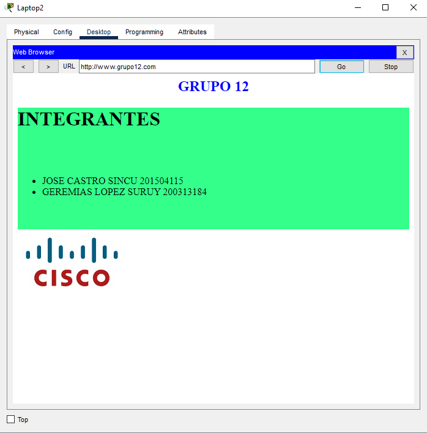

# PROYECTO 2
## REDES DE COMPUTADORAS 2
## FACULTAD DE INGENIERIA
## CREACION DE VLAN
>sw1> enable
>
>sw1# configure terminal
>
>sw1(config)# vlan [id]
>
>sw1(config-vlan)# name [nombre]
>
>sw1(config-vlan)# exit
>

## ELIMINAR VLAN
>sw1> enable
>
>sw1# configure terminal
>
>sw1(config)# no vlan [id]
>

##  VTP
### MODOS:
*   SERVIDOR.
*   CLIENTE.
*   TRANSPARENTE.
## CREACION DE VTP
>sw1> enable
>
>sw1# configure terminal
>
>sw1(config)# vtp mode [cliente|server|transparent]
>
>sw1(config)# vtp version [1|2]
>
>sw1(config)# vtp domain [domain]
>
>sw1(config)# vtp password [pass]
>
>sw1(config)# exit
>
>sw1# show vtp status

## MODO TRUNCAL
>sw1> enable
>
>sw1# configure terminal
>
>sw1(config)# interface fastethernet [#]/[#]
>
>sw1(config-if)# switchport mode trunk
>
>sw1(config-if)# switchport trunk allowed vlan [all|#]
>
>sw1(config-if)# exit

## MODO ACCESO
>sw1> enable
>
>sw1# configure terminal
>
>sw1(config)# interface fastethernet [#]/[#]
>
>sw1(config-if)# switchport mode access
>
>sw1(config-if)# switchport access vlan [id]
>
>sw1(config-if)# exit

## TOPOLOGIA GENERAL
*   4 SWITCH MULTICAPA 3650-24PS.
*   8 SWITCH MUTICAPA 3560-24PS.
*   4 SWITCH 2960-24TT.
*   4 LAPTOP.
*   4 PC.
*   3 SERVIDORES.
  

## VTP
### MODO SERVIDOR
* MSW11.
  

### MODO CLIENTE
* MSW1.
* MSW2.
* MSW3.
* MSW4.
* MSW5.
* MSW6.
* MSW7.
* MSW8.
* MSW9.
* MSW10.
* SW0.
* SW1.
* SW2.
* SW3.
  

### VLANS
* 121 RRHH.
* 122 IT.
* 123 RRHH_2.
* 124 IT_2.
* 100 SERVER_1.
* 200 SERVER_2.
* 10 WEB_SERVER.
  

## MODE TRUNK
### SWITCH CAPA 3
* MSW1.
* MSW2.
* MSW3.
* MSW4.
* MSW5.
* MSW6.
* MSW7.
* MSW8.
* MSW9.
* MSW10.
* MSW11.
### SWITCH CAPA 2
* SW0.
* SW1.
* SW2.
* SW3.
  

## MODE ACCESS
### SWITCHES
* MSW11.
* MSW10.
* SW0.
* SW1.
* SW2.
* SW3
  

## LACP
### MODE ACTIVE
* MSW3.
* MSW7.
  

### MODE PASSIVE
* MSW8.
* MSW9.

## VRRP O HSRP
### ACTIVE
* MSW1.
* MSW4.

  
### STANDBY
* MSW2.
* MSW6.

## EIGRP
### GRUPO 10 VLAN 121-123
* 192.168.121.0
* 192.178.123.0

### GRUPO 20 VLAN 122-124
* 192.168.122.0
* 192.178.124.0

## DHCP
### DHCP SERVER
* SERVER1-DHCP1.
* SERVER2-DHCP2.

## WEB SERVER
* SERVER0-WEB

## DHCP HELPER
#### VLAN 
* 121.
* 122.
* 123.
* 124.

## DHCP IP
### 192.168.121.0
* PC0.
* PC1.

### 192.168.122.0
* LAPTOP0.
* LAPTOP1.

### 192.178.123.0
* LAPTOP3.
* PC3.

### 192.178.124.0
* LAPTOP2.
* PC2.

